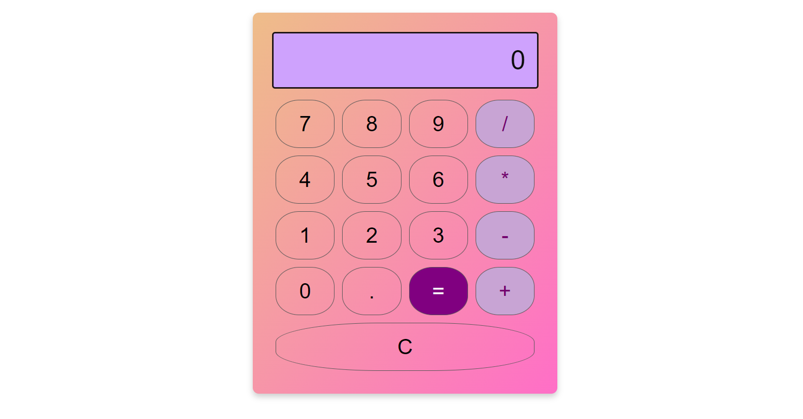

# Calculator
 
  The Calculator Website is a user-friendly online tool designed to perform various mathematical calculations with ease. This web application provides a clean and intuitive interface, making it convenient for users to quickly and accurately perform calculations without the need for a physical calculator.

  

  ## How to atrribute

  We welcome contribution from the community to help us expand and improve this project
  If you would like to contribute,follow these steps:

  1.fork the repository to your GitHub account
  2.Make your changes,and your content
  3.Open new pull request in this repository
